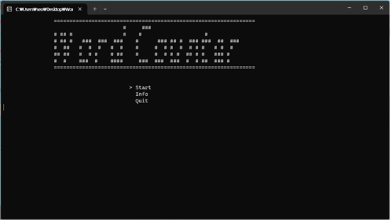
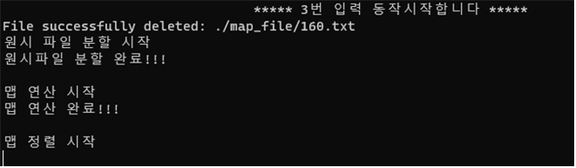
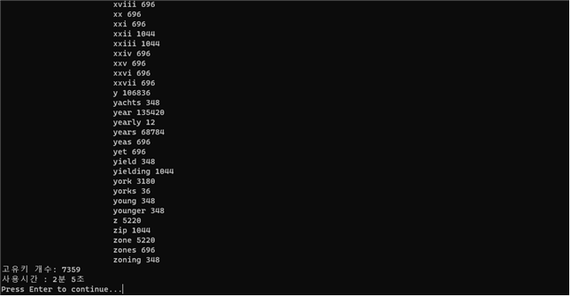
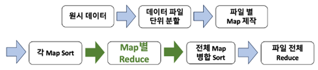
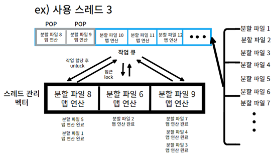
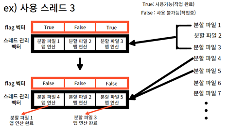
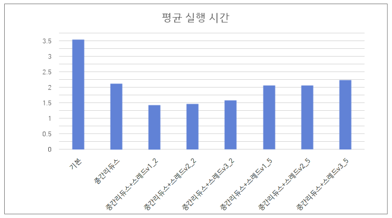

# DB_MapReduce_project

- 이 프로그램은 1GB 이상의 데이터에 대한 wordcount 기능을 수행하는 C++ 언어 기반의 응용 프로그램으로, single PC 기반에 MapReduce 시스템을 구현하였다. 성능 향상을 위해 중간 리듀스와 스레드 기능이 추가되어, 대용량 데이터를 효율적으로 기존보다 효율적으로 처리하여 빠른 결과를 제공한다.

## 실행 예시

- 시작화면  
  
    
- 모드 선택  
  
    
- 결과 화면  
  
   
  

## 이론 설명

- 단계

1. 원시데이터 분할 : 원본 데이터 txt 파일을 100,000개의 줄을 기준으로 각 txt 파일들로 분할
2. 파일 별 Map 제작 : 분할된 txt 파일을 호출하여 Map 단계 진행 후 결과 덮어씌우기
3. 각 Map Sort : 생성된 Map 파일에 대해서 내장 라이브러리 sort()을 이용하여 정렬
4. 전체 Map 병합 Sort : 외부 정렬로 병합 정렬을 사용하여 전체 맵을 합치기
5. 파일 전체 Reduce : 정렬된 맵에 대해서 reduce를 실행하여 파일 출력

 

- 중간 리듀스 :  
  중간 Reduce 기능이란 파일 단위로 분할된 후 제작된 Map들의 Sort가 끝난 후, 해당 Map을 한 번 Reduce하는 기능이다.  
  

 

- 스레드 적용법 :

1. 확률의존 스레드 버전(선택)  
    
     
2. 스레드 풀 버전  
    
     
3. flag 스레드 버전  
    
     

## 모드별 실행 시간 비교

- 실행 시간  
   
